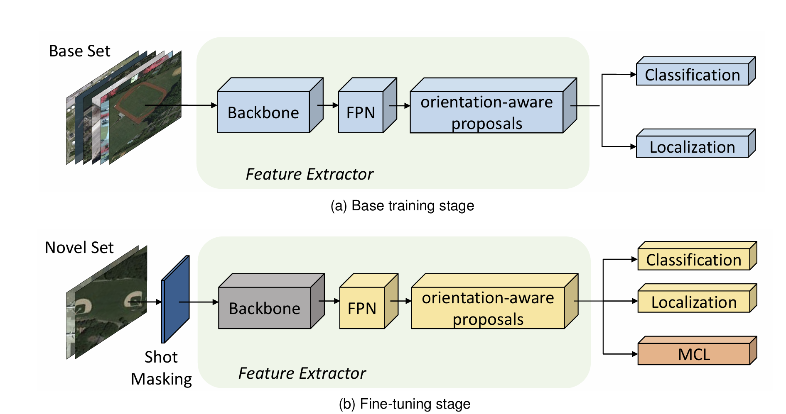

 # FOMC-FSOOD: Few-Shot Oriented Object Detection with Memorable Contrastive Learning
This repository implements the Few-shot Oriented Object Detection with Memorable Contrastive Learning (FOMC) method for aerial images, based on the paper "Few-shot Oriented Object Detection in Remote Sensing Images via Memorable Contrastive Learning" (arXiv:2403.13375). It is designed for few-shot oriented object detection (FSOOD) on the DOTA dataset, using S2A-Net as the base model with extensions for Memorable Contrastive Learning (MCL) and shot masking.



## Features
- Base Model: S2A-Net with ResNet-50 backbone, Feature Pyramid Network (FPN), Feature Alignment Module (FAM), and Oriented Detection Module (ODM) for handling oriented bounding boxes (OBBs).
- Few-Shot Enhancements:
    - Memorable Contrastive Learning (MCL) module for improved feature discriminability during fine-tuning.
    - Shot masking strategy to blur non-selected instances in few-shot samples, preventing label confusion.
- Dataset Support: Exclusively for DOTA-v1.0 (15 classes), with configurable base (12 classes) and novel (3 classes) splits.
- Training Paradigm: Two-stage training – base training on abundant base class data, followed by few-shot fine-tuning with MCL.
- Evaluation: Mean Average Precision (mAP) for OBBs using the official DOTA_devkit, with support for rotated IoU and NMS.
- Implementation: Pure PyTorch (no external detection toolboxes like MMDetection). Includes custom utilities for losses (focal, smooth L1), rotated IoU/NMS, and dataset handling.
- Few-Shot Settings: Supports K=1,2,5,10 shots, multiple seeds for averaging, and balanced base+novel sampling.

## Prerequisites
- Python 3.8+ (tested on 3.12 for compatibility with tools).
- GPU with CUDA support recommended for training.
- Access to the DOTA dataset (download from official source).

## Installation
1. Clone the Repository
```bash 
git clone https://github.com/Mustartoo124/FOMC_FSOOD
cd FOMC_FSOOD
```

2. Install Dependencies: 
```bash 
pip install -r requirements.txt
```

3. Download and Prepare DOTA Dataset
- Download DOTA-v1.0 from the official website: https://captain-whu.github.io/DOTA/dataset.html.
- Extract the dataset to data/dota/, ensuring:
    - Images in data/dota/images/.
    - Annotations in data/dota/labelTxt/ 
- Run the preparation script to convert annotations to JSON format:
```bash 
python data/prepare_dota.py
```

4. Setup DOTA_devkit for Evaluation
- The DOTA_devkit is required for computing mAP with rotated IoU.  
- Clone the repository into data/: 
```bash 
cd data
git clone https://github.com/CAPTAIN-WHU/DOTA_devkit.git
cd DOTA_devkit
```
- Install Swig (for building C++ extensions): 
    - Ubuntu/Debian: sudo apt-get install swig
    - macOS: brew install swig
    - Windows: Download from https://www.swig.org/download.html and add to PATH.
- Build the polyiou module:
```bash 
swig -c++ -python polyiou.i
python setup.py build_ext --inplace
```

## Data Preparation
1. Define Class Splits:
- Edit configs/splits.yaml if needed (default: 12 base classes, 3 novel: 'harbor', 'swimming-pool', 'helicopter').
2. Build Few-Shot Splits:
- Run the script to create few-shot subsets (samples K shots per novel class, applies shot masking via Gaussian blur on non-selected objects):
```bash
python data/build_fewshot_split.py
```

## Training
1. Base Training (on base classes with abundant data):
```bash
python tools/train_base.py --config configs/train_base.yaml
```
- Trains for 50 epochs (configurable).
- Saves checkpoints to checkpoints/base/.
- Uses focal loss for classification and smooth L1 for OBB regression.
2. Few-Shot Fine-Tuning (on balanced base + novel K-shots, with MCL):
```bash
python tools/finetune_fewshot.py --config configs/finetune_k5.yaml --shots 5
```
- Loads base model from checkpoints/base/model.pth.
- Freezes backbone, adds contrastive loss (λ=0.1, τ=0.07, memory size=8192).
- Trains for 20 epochs (configurable).
- Saves to checkpoints/finetune_k5/.
- Repeat for other K values (1,2,5,10) by changing config and --shots.

## Evaluation
Evaluate on the test split using mAP for novel classes:
```bash
python tools/evaluate.py --model_path checkpoints/finetune_k5/final.pth --split test
```
- Processes predictions per class to eval/dets/Task1_{classname}.txt.
- Uses DOTA_devkit's evaluation (rotated IoU=0.5) to compute per-class AP and mAP.
- Outputs mAP and per-class APs to console.

### Few-shot Oriented Object Detection Performance on Novel Categories of the DOTA Dataset

| **Method**           | **S²A-Net (5-shot)** | **S²A-Net (10-shot)** | **S²A-Net (20-shot)** | **FOMC (5-shot)** | **FOMC (10-shot)** | **FOMC (20-shot)** |
|----------------------|----------------------|-----------------------|-----------------------|-------------------|--------------------|--------------------|
| plane                | 0.13                 | 0.22                  | 0.33                  | **0.20**          | **0.26**           | **0.37**           |
| baseball-diamond     | 0.13                 | 0.17                  | 0.39                  | **0.11**          | **0.20**           | **0.43**           |
| tennis-court         | 0.34                 | 0.41                  | 0.53                  | **0.43**          | **0.58**           | **0.68**           |
| **Avg.**             | **0.20**             | **0.27**              | **0.41**              | **0.25**          | **0.34**           | **0.49**           |

 
The **FOMC** model consistently outperforms **S²A-Net** across all shot settings (5, 10, and 20 shots).

## Quickstart
Run the full pipeline (prep, base train, fine-tune for all K, evaluate) with:
```bash
 ./scripts/quickstart.sh
```
- Ensure executable: chmod +x scripts/quickstart.sh.
- Customize seeds/shots in configs/splits.yaml if needed.

## Troubleshooting
- Data Issues: Ensure DOTA images/annotations are correctly placed. If JSON conversion fails, check txt formats.
- Build Errors in DOTA_devkit: Verify Swig installation and Python version match.
- Rotated NMS/IoU: Implemented in tools/utils.py (decode_obb, compute_iou) – debug with small batches if predictions are off.
- Memory/Performance: Reduce batch_size in configs if OOM errors occur.
- Customizations: Adjust hyperparameters in YAML configs (e.g., lr, epochs, λ_mcl).